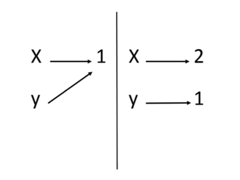
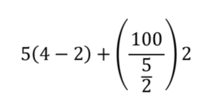
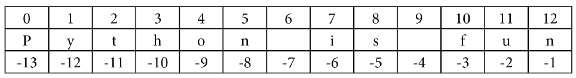
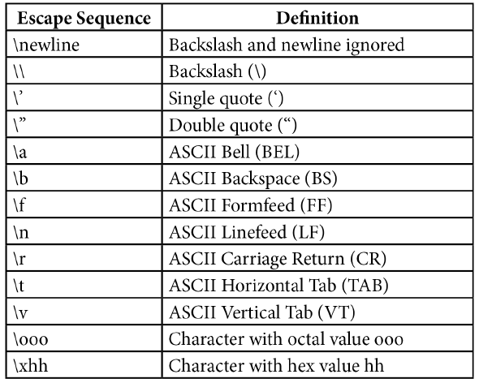

# Python Basic

## Introduction

Python is a high-level, general-purpose programming language. It is notorious for having a very simple “pseudocode-like” syntax that places emphasis on readability and expressiveness. This not only makes code simpler to write but also easier to maintain. Additionally, it features a vast standard library that is augmented by an even larger array of third-party libraries. These are all developed and supported by Python’s very active community.

Development is also faster in Python, as it is an interpreted language. This means that the instructions are interpreted at runtime and there’s no need to pre-compile the program into machine language instructions. This makes for quick prototyping and experimentation. Python’s interpreted nature, along with its dynamic typing system, are what really set it apart from languages such as Java or C++.

Python also supports multiple paradigms, such as the following:

- Object-oriented programming
- Functional programming
- Imperative programming
- Procedural programming

TThis versatility, coupled with Python’s ability to run on all operating system platforms from Windows and GNU/Linux to macOS, have led to its popularity. As a matter of fact, today, Python comes built into most GNU/Linux distributions as well as macOS.

Python can be applied for writing automation scripts, machine learning, scientific computation, big data, web applications, GUI programming, IoT devices—just about anything. It’s a multipurpose language and is easy to extend. Because of this, Python has been adopted by tech companies such as Google (for YouTube), Uber, Facebook, and Mozilla, further ensuring its support and development.

In this lesson, we will write our first Python program and play with the interpreter through the use of the Python interactive shell. We will also take a look at the different ways of running a Python program

### Python 3 vs Python 2

Before we move on to getting our hands dirty, we'll take a brief look at the history of Python. Out there in the wild, you'll find codebases that use Python 3 or the older Python 2. The two are very similar. Generally, a lot of the code written for Python 3 will run on Python 2 and vice versa, but this should not be practiced as there are a few syntactic differences that can bring about issues. However, the majority of the differences between the two are under the bonnet.

Currently, support still runs for Python 2, but Python 3 is the only one in active development, meaning any new features brought to the language are only developed for Python 3. Additionally, the majority of commonly used third-party libraries have now ported to Python 3 and are withdrawing development for their Python 2 versions. For this reason, we will be using Python 3.6 for all of the examples in this course.

## Python Installation

We are going to be writing our first program through the Python interactive shell. Before we begin, ensure that you have Python installed in your environment.

To check whether Python is installed properly, perform the following steps:

1. Go to the terminal.
2. Type in the command `python` and press Enter. This should open the Python interpreter, and you should see a message containing the Python version installed.

Observe the output. It should be similar to what's shown below:

```sh
Python 3.6.8 (default, Jan 14 2019, 11:02:34)
[GCC 8.0.1 20180414 (experimental) [trunk revision 259383]] on linux
Type "help", "copyright", "credits" or "license" for more information.
>>>
```

Once the interactive shell opens, on the first line, you should see the Python version information. This includes its major version and the release date. As you can see from the preceding screenshot, it shows us that we're using Python 3, minor version 6.8, which was released on January 14, 2019. We can also see information on the system the interactive shell is running on. On the third line, we can see a few examples of commands we can write, and finally the prompt to enter a command `>>>` on the fourth line.

The Python interactive shell can be thought of as just any other shell that interfaces with the operating system (for example, Bash or CMD), but in this case, it interfaces with the Python interpreter. Through it, we can execute Python instructions. It presents a command-line interface.

## Working with the Python Interpreter

In this activity, we will learn how to work with the Python interpreter:

In the python shell, enter the command to run the popular `"Hello World!"` program:

```sh
>>> print("Hello World!")
Hello World!
>>>
```

Calling `print` logs the passed message to the standard output.

Anything you type into the shell is echoed back. Type `"Echo"` in the shell to check this:

```sh
>>> "Echo"
'Echo'
>>> 1234
1234
>>>
```

You can even do some calculations (note that the order of operations is observed). Carry out a few mathematical operations in the terminal, like this:

```sh
>>> 9 + 3
12
>>> 4 * 5
20
>>> -6 + 5 * 3
9
>>>
```

Finally, exit the shell by running the `exit()` command:

```sh
>>> exit()
```

When you exit the Python interactive shell and relaunch it, you will notice that any variables you had defined or commands you had run in the previous session are gone. Therefore, we can't reuse them. Another way to run a Python program is by running code that has been saved in a file. This allows us to run many instructions at a time and also reuse them, as we'll see in a later lesson. In the next lesson, we'll take a look at how to do this.

## Working with the Python Shell (`Challenge`)

For this challenge, you will perform some basic operations using the Python interactive shell.

Go to the terminal and open the interactive python shell and complete the tasks below:

### Task

- [ ] Print "Happy birthday" to the console.
- [ ] Execute the code `17 + 35 * 2`
- [ ] Using the `print` function, print the numbers 1 to 9 on a single row.\
  Example : `1 2 3 4 5 6 7 8 9`

## Writing and Running Simple Scripts

Running quick commands through the interactive shell is fun. It comes in handy when you have a quick hypothesis that you want to test out or when you want to check whether a specific method exists for some data type. However, you can’t really write a full-fledged program through the interactive shell.

Python allows you to run your instructions from a saved file. A file containing Python instructions is called a `module`. A script is a module that can be run. Anything you can run on the interactive shell can be written and run as a Python script.

By convention, Python scripts should have the file extension `.py`. The filename should be a valid filename, as defined by your operating system.

## Creating a Script

In this activity, we will create a script that displays `Hello` five times in a single line:

In your file named `main.py`, insert the following code:

```py
print("---------------------------------")
print("Hello " * 5)
print("---------------------------------")
```

In your terminal, run the following command: `python main.py`. You should see the following output:

```sh
workspace $ python main.py
---------------------------------
Hello Hello Hello Hello Hello
---------------------------------
workspace $
```

Python opens the file and executes each instruction, line by line. First, it runs the call to `print` on the first line and prints out a series of dashes. It then calls the second `print`, which prints our message five times, hence the `* 5` bit. This can be any value you want and is basically a shorthand way of saying, "repeat that string of characters an *n* number of times", *n* being `5` in our case. For example, if you change that `5` to `100`, it'll print `Hello` 100 times, as shown in the following code:

```py
print("---------------------------------")
print("Hello " * 100)
print("---------------------------------")
```

```sh
workspace $ python main.py
---------------------------------
Hello Hello Hello Hello Hello Hello Hello Hello Hello Hello Hello Hello Hello Hello Hello Hello Hello Hello Hello Hello Hello Hello Hello Hello Hello Hello Hello Hello Hello Hello Hello Hello Hello Hello Hello Hello Hello Hello Hello Hello Hello Hello Hello Hello Hello Hello Hello Hello Hello Hello Hello Hello Hello Hello Hello Hello Hello Hello Hello Hello Hello Hello Hello Hello Hello Hello Hello Hello Hello Hello Hello Hello Hello Hello Hello Hello Hello Hello Hello Hello Hello Hello Hello Hello Hello Hello Hello Hello Hello Hello Hello Hello Hello Hello Hello Hello Hello Hello Hello Hello
---------------------------------
workspace $
```

Finally, the last line is executed, just like our first, and prints out dashes. This execution is done in a blocking manner, so each line is executed after the previous line has completed running.

```sh
workspace $ python main.py
---------------------------------
Hello Hello Hello Hello Hello
---------------------------------
workspace $
```

## Running a File Containing Invalid Commands

As with the interactive shell, putting in invalid instructions also causes an error. Add the following to `main.py` and run it:

```py
print("---------------------------------")
print(invalid instruction)
print("---------------------------------")
```

You should see an error. This output is called a **stack trace**. It tells us useful things such as where the error happened, what kind of error it was, and what other calls were triggered along the way when we ran our command. Stack traces should be read from bottom to top. Another name for a stack trace is a **traceback**.

```sh
workspace $ python main.py
  File "main.py", line 3
    print(invalid instruction)
                            ^
SyntaxError: invalid syntax
workspace $
```

The last line tells us what kind of error was raised, that is, a `SyntaxError`, meaning that our instructions were invalid. The line above it logs out the source line that caused the error, and the first line references our `main.py` module where the line is located. You will be seeing different types of errors as you go through this course, and there will be an in-depth look at errors and exception handling in one of the later lessons. For now, it is important that you understand how to read a stack trace and identify what is causing the error, and then act accordingly to fix it.

## Passing User Arguments to Scripts

To make a script more dynamic, you can have the user provide arguments to it when calling it:

In your `main.py` file, add the following code:

```py
import sys  
print("This argument was passed to the script:", sys.argv[1])
```

Run the script as usual, passing it an argument, as illustrated here:

```sh
python main.py foobar
```

The output should be as follows:

```sh
workspace $ python main.py foobar
This argument was passed to the script: foobar
workspace $
```

> Running this script without any arguments will raise an `IndexError`

We have some new syntax in this script. We won't go over all of it in detail in this lesson, but for the purposes of this explanation, `import sys` imports the `sys` module that's built into Python into our module. This module provides access to Python interpreter functions. For our purposes, we're using it to read command-line arguments that have been passed to the interpreter when invoking our script.

> We will go over imports and the Python standard library in full detail in Modules, Packages, and File Operations.

When we call `sys.argv[1]`, we're asking for the first argument that's been passed when running the script. Generally, you can pass as many arguments as you like by separating each argument with a blank space.

## Running Simple Python Scripts (`Challenge`)

In this challenge, we will create a name card generator script that, when called with a first name and last name, will generate a name card with the names.

The steps are as follows:

1. your editor, open the script named `main.py`.
2. Use two `print` statements to print `First name` and `Last name`. Also, use these print statements to print 33 underscores as borders above and below the names.
3. Two parameters should be passed with the script: one for the first name and the second for the last name.
4. Run the script by passing two string arguments.

Your output should be similar to the following:

```sh
workspace $ python main.py Rizqi Mubarak
_________________________________
First name: Rizqi
Last name: Mubarak
_________________________________
workspace $
```

### Task (2)

- [ ] Following the instructions above, pass a first and last name argument to the file `main.py` which should return the system arguments bordered by **33** underscores on the top and bottom.

## Python Syntax

In this lesson, we'll be taking a look at how the Python language expressions are structured. Essentially, we will learn what it takes to write a valid Python program.

### Variables

As we know, variables are references to values in memory.

Variables in Python can reference values of different data types such as strings, integers, floating point values, Booleans, and different data types and data structures, as we will see later on in this course. Python, in contrast to statically typed languages such as Java or C++, doesn’t require you to pre-declare a variable’s data type. It determines the type during runtime.

You can think of a variable as a box with a named label on it. The box on its own has no value but becomes valuable after you put something inside it. The box represents the things inside it and, similarly, a variable is used to represent the value inside it.

Additionally, a variable’s value and type can change during runtime. Any variable can be used to store any data type and can be used as long as it has already been defined. Before we look at how to assign variables to values, let’s briefly go over the different types of values/data types that have been encountered thus far and the ones we will be dealing with in this lesson.

### Values

Python supports several different types of values. These values are what variables can be assigned to. Thus far, we have encountered strings and numeric values such as integers.

#### Numeric Values - Integers

Mathematically, integers are whole numbers that are either positive or negative. The same definition is applicable for Python integers.

Here is an example of an integer expression in Python. As we saw earlier, Python echoes whatever you write in the interactive shell as shown:

```sh
>>> 7
7
>>>
```

We also saw the different symbols, such as `+`, `*`, and `-`, that can be used to perform different arithmetic operations on the integer values as shown:

```sh
>>> 5 + 4 + 6 + 9
24
>>> 5 * 5
25
>>> 42 - 16
26
>>>
```

#### String Values

Another type of value that we have seen previously was a string value. This is a sequence of characters that’s placed in between two quotation marks, for example, `"January"`, `"Chops Maloy"`, and `'UB40'`. You can use both double and single quotes to denote strings. Strings can contain numbers, letters, and symbols.

```sh
>>> type("3 Musketeers")
<class 'str'>
>>> type('First Order!')
<class 'str'>
>>>
```

As you can see, it tells us that the type of the value `"3 Musketeers"` is `str` (short for string).

## Checking the Type of a Value

We can also check the type of a value by using the `type` function that is built into Python:

Open the Python interactive shell and enter the following code to view the type of the numeric value `7`. Observe the output:

```sh
>>> type(7)
<class 'int'>
>>>
```

As you can see, it tells us that the type of `7` is int (short for integer).

Now, enter the following code, and observe the output:

```sh
>>> type(4+3)
<class 'int'>
>>>
```

Enter the following code at the prompt, and observe the output:

```sh
>>> type("7")
<class 'str'>
>>>
```

Enter `type(7)`:

```sh
>>> type('7')
<class 'str'>
>>>
```

> The part in the output before `int` says `class` because everything in Python is an **object**.

There are a few other numeric types of values, such as floating-point numbers, but we will review those in the next lesson.

## Type Conversion

Sometimes, you may have a string with an integer inside it or an integer that you want to put in a string. The first scenario often happens with user input in which everything is returned inside a string. To be able to use it, we need to convert it to the desired data type.

Python allows you to convert string type values to integer type values and vice versa. Using the built-in `str` function, you can convert an integer to a string:

```sh
>>> str(7)
'7'
>>>
```

Strings can also be converted to integers, as long as they hold a valid integer value within. This is done by use of the built-in `int` function:

```sh
>>> int("100")
100
>>>
```

An error occurs if we try converting a string that doesn’t contain an integer. Here,the string `"Foobar"` can't be converted because it's a string of letters. `"3.14159"` also fails because it is a float, and not an integer:

```sh
>>> int("Foobar")
Traceback (most recent call last):
    File "<stdin>", line 1, in <module>
ValueError: invalid literal for int() with base 10: 'Foobar'
>>> int("3.14159")
Traceback (most recent call last):
    File "<stdin>", line 1, in <module>
ValueError: invalid literal for int() with base 10: '3.14159'
>>>
```

These are the basic types of values we will be dealing with in this course.

## Assigning Variables

In this activity, we will learn how to assign a value to a variable.

Assign a value to a variable in Python using the following syntax:

```sh
>>> number = 7
>>>
```

Next, print the variable to the standard output; this should reveal its value:

```sh
>>> print(number)
7
>>>
```

However, if we try using a variable before assigning it a value, the Python interpreter will raise an error:

```sh
>>> del number
>>> print(number)
Traceback (most recent call last):
    File "<stdin>", line 1 in <module>
NameError: name 'number' is not defined
>>>
```

On the first line, we are using a new statement: `del`. `del` unbinds a name/variable (Python refers to variables as names) from the current namespace. Calling `del number` thus deletes the variable `number` from the current namespace.

> A namespace is a mapping of names/variables to their values

This means that the reference number is removed and no longer points to the value `7`. When we try printing out the now nonexistent variable, we get an error stating that the name `number` is not defined.

## Using Variables

We use variables when we have a value in our code that we want to use multiple times. They prevent us from having to repeat that value each time we want to use it, as variables store the values in memory.

When we store values in memory, we can reuse them as many times as we'd like:

First, assign the value `7` to the `number` variable:

```sh
>>> number = 7
```

We can now use this variable for any operations we'd like. Print out the value of the `number` variable, multiplied by `5`:

```sh
>>> number * 5
35
```

Next, print out `number` added to `2`:

```sh
>>> number + 2
9
```

Then, print out number divided by 3.5:

```sh
>>> number / 3.5
2.0
```

Print out `number` subtracted from itself:

```sh
>>> number - number
0
```

Note that, despite having used it, the value of `number` won't change unless we reassign it. Reassigning `22` to `number` changes its value and verifies this:

```sh
>>> print(number)
7
>>> number = 22
>>> print(number)
22
>>>
```

You can also assign the resulting value of another operation to a variable. Do this as follows:

```sh
>>> number = 7
>>> x = number + 1
>>> x
8
>>>
```

String values can also be assigned and used in a similar fashion. First, set the `message` variable to the string `"I love Python"`:

```sh
>>> message = "I love Python"
```

Print out the value of the `message` variable and add an exclamation point at the end:

```sh
>>> message + "!"
'I love Python!'
```

Print out `message` plus three exclamation points:

```sh
>>> message + "!" * 3
'I love Python!!!'
>>>
```

Here, we can see the application of a new operation to strings: `+`. We use this whenever we want to concatenate (add together) two strings.

This only applies to strings, and thus trying to concatenate a string with any other data type will raise an error. We shall look at it in greater depth in the next lesson.

An interesting phenomenon with Python variables is that they are not deeply linked:

```sh
>>> x = 1
>>> y = x
>>> x = 2
>>> print(x)
2
>>> print(y)
1
>>>
```

A behavior you'd expect would be that `y` being assigned to `x` would change upon changing `x`, but it doesn't and stays the same. What do you think is happening?

Since Python variables point to values in memory, when `y` is assigned to `x`, it does not make an alias for `x` but instead points the variable `y` to where the value of `x`, 1, is. Changing `x` changes its pointer from 1 to 2, but `y` remains pointing to its initial value:



## Multiple Assignment

In Python, you can also assign multiple variables in one statement, like so:

```sh
>>> a, b, c = 1, 2, 3
>>> print(a)
1
>>> print(b)
2
>>> print(c)
3
>>>
```

The assignment works so that the first variable, `a`, is assigned the first value, `1`, after the `=` sign. The second variable, `b`, is assigned the second value, `2`, and the third variable, `c`, is assigned the third value, `3`.

What happens if we try to assign more variables than we pass values?

```sh
>>> a, b, c = 1, 2
Traceback (most recent call last):
    File "<stdin>", line 1, in <module>
ValueError: not enough values to unpack (expected 3, got 2)
>>>
```

The Python interpreter raises an error and tells us it didn't get enough values to assign to the variables we declared in our statement.

A similar error is raised when we try to assign more values than there are variables:

```sh
>>> a, b = 1, 2, 3
Traceback (most recent call last):
  File "<stdin>", line 1, in <module>
ValueError: too many values to unpack (expected 2)
>>>
```

## Using Variables and Assign Statements (`Challenge`)

Write a script that will use distance in kilometers and time in hours to calculate and print out speed in kilometers per hour, miles per hour, and meters per second.

Here are some hints:

- The formula for calculating speed is **distance/time = speed**.
- To convert kilometers to miles, divide the kilometers by 1.6.
- To convert kilometers to meters, multiply the kilometers by 1,000.
- To convert hours to seconds, multiply hours by 3,600.
- The output should resemble the below image.

The steps are as follows:

1. In your editor, open the file named `main.py`.
2. On the first two lines, declare two variables for the distance in kilometers and time in hours and assign the values `150` and `2`, respectively.
3. In the next two lines, calculate the distance in miles and distance in meters based on the distance in kilometers.
4. Then, calculate the time in seconds based on the time in hours.
5. Next, calculate the speed in kilometers per hour, speed in miles per hour, and speed in meters per second.
6. Finally, add print statements to `print` out the results.
7. In your terminal, run the script by using the `python main.py` command.

The output should look like this:

```sh
workspace $ python main.py
The speed in kilometers per hour is: 75.0
The speed in miles per hour is: 46.875
The speed in meters per seconds is: 20.833333333333332
workspace $
```

### Task (3)

- [ ] If the distance in kilometers is 150 and time in hours is 2, calculate and print out the speed in kilometers per hour.
- [ ] If the distance in kilometers is 150 and time in hours is 2, calculate and print out the speed in miles per hour. (`miles = km / 1.6`)
- [ ] If the distance in kilometers is 150 and time in hours is 2, calculate and print out the speed in meters per second.

## Naming Identifiers and Reserved Words

Python, like other languages, has a couple of rules on naming identifiers such as variable names, class names, function names, module names, and other objects. Some are strictly enforced by the interpreter, while others are simply by convention, and developers are at liberty to ignore them. The rules and conventions are designed to avoid confusion when the interpreter is parsing through code or to make the code more easily readable by humans. We'll start off by going through some of the rules for naming variables and other identifiers:

- An identifier can consist of upper and lowercase letters of the alphabet, underscores, unicode identifiers, and digits 0 to 9.
  
> As per the Python documentation, you can find the list of permitted unicode identifiers [here](https://www.dcl.hpi.uni-potsdam.de/home/loewis/table-3131.html).

- An identifier cannot begin with a digit; for example, `7x` is an invalid variable name.
- No other characters can be in identifiers. This means spaces or any other symbols. Spaces most notably occur in module names as some operating systems will permit filenames with spaces. This should be avoided.
- A Python keyword cannot be used in an identifier name, for example, `import`, `if`, `for`, and `lambda`.

The following are examples of valid variable definitions:

```sh
>>> meaning_of_life = 42
>>> COUNTRY = "Wakanda"
>>> Ω = 38.12
>>> myDiv = "<div></div>"
>>> letter6 = "f"
>>>
```

It should also be noted that Python identifier names are case sensitive. Consider this:

```sh
>>> foobar = 5
```

This is a different variable from the following one:

```sh
>>> Foobar = 5
```

## Python Keywords

Certain names in Python cannot be used as they are parts of the language syntax. Such words are known as **reserved words** or **keywords**. An example of a reserved word is `import`, which is a statement used for when you want to import a module into your code.

Python has several keywords. To get the full list, perform the following steps:

Open the Python interactive shell:

```sh
Python 3.6.8 (default, Jan 14 2019, 11:02:34)
[GCC 8.0.1 20180414 (experimental) [trunk revision 259383]] on linux
Type "help", "copyright", "credits" or "license" for more information.
>>>
```

In the output, you will see a line saying

`Type "help", "copyright", "credits" or "license" for more information`

1. Run `help()` to open the help utility.
2. Type `keywords` in the prompt:

```sh
help> keywords
```

- You should see the following output:

```sh
Here is a list of the Python keywords.  Enter any keyword to get more help.

False               def                 if                  raise
None                del                 import              return
True                elif                in                  try
and                 else                is                  while
as                  except              lambda              with
assert              finally             nonlocal            yield
break               for                 not
class               from                or
continue            global              pass

help>
```

- Quit the `help` utility by typing `quit`. This should take you back to the interpreter prompt:

```sh
help> quit
```

You should not use any word from this list of keywords as an identifier name. Note that you don't have to remember them all as the Python interpreter will restrict you from using them.

In the following example, we are trying to use the keyword `for`, but we get a syntax error upon doing so. The same applies for all keywords:

```sh
>>> for = "Elise"
    File "<stdin>", line 1
        for = "Elise"
        ^
SyntaxError: invalid syntax
>>>
```

## Python Naming Conventions

Python has several guidelines for naming identifiers that aren't enforced by the interpreter. These guidelines are meant for consistent code and making it more readable. Please note that these are simply guidelines and the programmer is at liberty to ignore them.

It should be counterpointed that ignoring naming conventions eventually leads to a road of regret as they provide several advantages, such as the following:

- Makes the code easier to read and understand for other programmers, since they'd find consistent and instantly recognizable patterns
- Enhances clarity and reduces ambiguity
- Makes automated refactoring easier, as the automation tools would have consistent patterns to look for
- Provides additional information about the identifiers; for example, when you see a variable name in all caps, you immediately know that it is a constant

Some of these conventions and guidelines are given here.

Compound variable names should be written in `snake_case` notation.

Prefer this:

```sh
>>> first_letter = "a"
```

Over this:

```sh
>>> firstLetter = "a"  # camelCase
```

```sh
>>> FirstLetter = "a"  # PascalCase
```

Naming for constants should be written in capital letters to denote that their values are not meant to change. In reality, though, Python has no way of restricting the value of a constant from being changed as they are variables, just like any other:

```sh
>>> NUMBER_OF_PLANETS = 8
```

```sh
>>> RADIUS_OF_THE_EARTH_IN_KM = 6371
```

Note that we can change a constant's value:

```sh
>>> NUMBER_OF_PLANETS = 9
>>>
```

Avoid lower case `l` or uppercase `O` as single character variable names, as in some fonts, these letters can be mistaken for 1 and 0, respectively, making the code harder to read.

In the next lesson, we'll learn about comments, their importance, and how to write them in Python.

## Variable Assignment and Variable Naming Conventions (`Challenges`)

Write a script that will calculate the area and circumference of a circle with a radius of 7. In this activity, we'll get better acquainted with variable assignment as well as variable naming conventions.

Here are some hints:

- The formula for calculating area is `π * r^2` , `r` being the radius.
- The formula for calculating circumference is `2 * π * r.`
- `π` can be approximated to 3.14159.

The steps are as follows:

1. Open the `main.py` file in your editor.
2. On the first two lines, declare your constant, π (`PI`), and the radius of the circle with a value of `7`
3. Write the lines to run your calculations.
4. Display the results by using `print` statements.
5. Run the script by using the `python main.py` command.

The output should look like this:

```sh
workspace $ python main.py
Circumference of the circle: 43.98226
Area of the circle: 153.93791
workspace $
```

### Task (4)

- [ ] Print the circumference and area of a circle with a radius of 7.

## User Input

In this lesson , we will look at how we can take user input from the keyboard, how to write comments, and the importance of indentation while writing Python code.

### User Input from the Keyboard

Python has a very handy function for obtaining user keyboard input from the CLI called `input()`. When called, this function allows the user to type input into your program using their keyboard. The execution of your program pauses until the user presses the `Enter` key after completing the input. The user's input is then passed to your program as a string that you can use. The following is an example of this:

Declare the following variable:

```sh
>>> message = input()
```

The program execution will halt until you input a value and hit the **Enter** key:

```sh
Peter Piper picked a peck of pickled peppers
>>>
```

The `message` variable was assigned to the value that we passed. Let's print it out:

```sh
>>> print(message)
Peter Piper picked a peck of pickled peppers
>>>
```

### Passing in a Prompt to the Input Function

You may have noted that there is no cue that lets us know when to type or what to type. You can pass a prompt to the `input` function to do this. The prompt is written to standard output without a trailing newline and serves as a cue for the user to pass in their input. Let's view this in action.

Declare the following variable, passing in the prompt **Enter a tongue twister**: to the `input` function. This will be displayed to the user:

```sh
>>> tongue_twister = input("Enter a tongue twister: ")
Enter a tongue twister:
```

Let's type in our tongue twister and hit the **Enter** key. The `tongue_twister` variable will then be set, and printing it out should reveal the value we passed:

```sh
Enter a tongue twister: She sells seashells by the seashore
>>> print(tongue_twister)
She sells seashells by the seashore
>>>
```

### Using Different Input Data Types in your Program

The values returned by the `input` function are always strings. Sometimes, a string may not be the data type you're expecting in your program. As we saw earlier, you can convert strings to integers using the built-in `int` function. To retrieve integer values from user input, all your program needs to do is cast the string that is returned as a value by the `input` function. Let's take a look at an example of this:

```sh
>>> number = int(input("Find the square root of: "))
Find the square root of: 49
>>> print("The square root of", number, "is", number ** 0.5 )
The square root of 49 is 7.0
```

Here, we take the user's input which is a string, convert it to an integer using the `int` function, and print out its square root.

## Fetching and Using User Input

In this activity, we will aim to get better acquainted with fetching and using user input as well as practice multiple assignment:

Open your interpreter and declare the following variables:

```sh
>>> name, hobbies = input("What is your name? "), input("What are your hobbies? ")
```

Next, type in the values when prompted:

```sh
What is your name? John Doe
What are your hobbies? swimming, reading, playing instruments, drawing, programming
>>>
```

Finally, print out the values of the variables:

```sh
>>> print("Your name is", name, "and your hobbies are", hobbies)
Your name is John Doe and your hobbies are swimming, reading, playing instruments, drawing, programming
```

We can get user input to use in our program in Python by using the built-in `input` function. You can pass a prompt argument to the `input` function that'll act as a cue for the user to pass their input. The `input` function always returns values as strings that we can optionally cast to the data type we desire.

## Comments and Indentation

### Coments

**Comments** are an integral part of programming.

Comments can be thought of as notes on the code that give us more contextual information about it. They can tell us why certain decisions were made, some improvements that can be made in future, and also explain the business logic. In short, they make the code easier to understand for humans.

There are three different ways to write Python comments, **documentation strings** (**docstrings** for short), inline comments, and block comments.

### Block and Inline Comments

Block and inline comments start with a pound sign, `#`. A **block comment** comes in the line before the statement it annotates and is placed at the same indentation level:

```py
# increment counter
counter = counter + 1
```

**Inline comments** are placed on the same line as the statement it annotates:

```sh
>>> print(foobar)  # this will raise an error since foobar isn't defined
```

Block comments are applied to the code that follows them and should be indented at the same level as the code it's meant for. While they serve the same purpose as inline comments, block comments are to be preferred by convention as they are more immediately noticeable and unambiguous as to the code they are annotating.

### Documentation Strings

A documentation string, or docstring for short, is a literal string used as a Python comment. It is written and wrapped within triple quotation marks; `"""` or `'''`. Docstrings are often used to document modules, functions, and class definitions. The following is an example module that's been documented with a docstring. Module docstrings should be put at the beginning of the file:

```py
"""
This script can be called with two integer arguments to return their sum
"""
import sys
num_1  = int(sys.argv[1])
num_2  = int(sys.argv[2])

print(num_1, "+", num_2, "=", num_1 + num_2)
```

Furthermore, you can also use docstrings to write multiline comments:

```py
"""
This loop goes through all the numbers from 1 to 100
printing each out
"""
for i in range(1, 101):
  print(i)
```

Sufficiently commenting our code leads to easily maintainable and easier-to-read code. Since we often spend more time reading code than writing it, it is important that we write comments, but even more important is that we write code readable enough to need as few explanations as possible.

### Indentation

A **block** is a group of statements that are meant to be executed together. Blocks are a fundamental aspect of modern programming languages since flow of control structures (structures that determine the flow of execution of code) are formed from blocks. Blocks allow a set of statements to be executed as though they were a single statement. Different languages represent blocks differently, but most commonly, the following syntax is used:

```c
if (true) {
  // execute this block of statements
} else {
  // execute other block of statements
}
```

> `if` is a common control flow structure that evaluates Boolean expressions and determines where the program should go.

In the preceding code snippet, a block is denoted by whatever is inside the curly braces. If the condition is true, then execute a certain block of statements; otherwise, execute the other block. Often, blocks can be nested within other blocks.

In Python, statements are grouped using whitespace, that is, blocks are indented within other blocks instead of using curly braces.

> Whitespace is any character in a piece of text that occupies space but doesn't correspond to a visible marking.

Observe the following, which is the Python equivalent of the previous code snippet:

```py
if True:
    # execute this block of statements
    print("Block 1")
else:
    # execute other block of statements
    print("Block 2")
```

Python uses whitespace to denote blocks. Just as blocks are denoted by statements enclosed in curly braces in several other languages, any statement that's indented in Python forms a new block, becoming a child of the previous statement with the parent statement being suffixed with a colon, `:`. In place of a closing curly brace, a statement that would come after that block would be outdented outside it, as we've seen with the `else` statement that came after the `if` block.

Generally, you can use any number of spaces as long as every statement in the block has an equal amount of indentation, although the standard is four spaces:

```py
if True:
  x = 5
  y = x
  print(x, y ** 2)
```

### Summary

In this lesson, we have looked at two ways of running Python programs. We can run commands through the Python interactive shell or by running saved scripts. While you'll mostly find yourself running programs from saved scripts, you will find the freedom and quick gratification of using the interactive shell to run a quick check very convenient. These two methods will come in handy on your Python journey.

We have also covered the Python syntax in detail in this lesson. We started with variable assignment in Python. We looked at the different types of values Python variables can be assigned to, the syntax for assigning them, as well as the importance of reserved keywords in Python.

We then looked at the built-in `input` function and how it enables us to take input from a user keyboard. We looked at the different ways of writing comments in Python code, and then we finished the lesson by looking at the importance of indentation in writing readable, maintainable Python code.

In the next lesson, we will look at data types such as integers, strings, Booleans, and more.

## Fixing Indentations in a Code Block (`Challenge`)

Fix the code snippet in the main.py file from the code bundle to have the appropriate indentation in each block. Once you fix it, run the script in the terminal and verify that you get the output. Don't worry if you don't understand what the code is doing; the goal is to get comfortable with indentations. The incorrect code is also shown here:

```py
# Fix this indentations
if 5 > 2:
    print("Greater than")
   x = 5
  print(x * 2)
else:
    print("Less than")
   Print(2)
```

Here's a hint: Indentation for statements in a block is dictated by the first statement's indentation level.

The output of the correct syntax should be as follows:

```sh
workspace $ python main.py
Greater than
10
workspace $
```

### Task (5)

- [ ] Fix the indentations in the code above.

## Implementing User Input and Comments in a Script (`Challenge`)

Write a script that takes a number from a user’s input and prints out its multiplication table from 1 to 10.

The steps are as follows:

1. Open the file named main.py in your editor.
2. On the first line, add a docstring explaining what your file does. Then, assign a variable called `number` to the user’s input and cast it to an integer.
3. Next, print 20 underscores as the top border of the table.
4. Multiply your number with each number from 1 to 10 and print that out.
5. Finally, print 20 underscores again for the bottom border of the table, as in step 3.
6. Run the file by using the `python main.py` command.

The output should be like this:

```sh
workspace $ python main.py
Generate a multiplication table for: 4
____________________
1 : 4
2 : 8
3 : 12
4 : 16
5 : 20
6 : 24
7 : 28
8 : 32
9 : 36
10 : 40
____________________
workspace $
```

### Task (6)

- [ ] Follow the steps above to generate a multiplication table from a user input.

## Numerical Data

In the previous lesson, we learned about variables and looked at a few of the values/types of data that can be assigned to them. Specifically, we dealt with data of the string and integer types. In this lesson, we will look at the other data types that Python supports. Data types classify data, to tell the interpreter how the program intends to utilize that data. Data types define the different operations that can be performed on the data, how the data is stored, and the meaning of the data.

Let's begin with numerical data types.

### Integers

Integers, as we saw in the previous lesson, are numerical data types that are comprised of whole numbers. Whole numbers can be either negative or positive. In the following example, we will see how Python represents integers, and then, we can check their types:

```py
integer = 49
negative_integer = -35
print(type(integer), integer)
print(type(negative_integer), negative_integer)
```

```sh
<class 'int'> 49
<class 'int'> -35
```

Additionally, Python integers have unlimited precision. This means that there are no limits to how large they can be (save for the amount of available memory):

```py
large_integer = 34567898327463893216847532149022563647754227885439016662145553364327889985421
print(large_integer)
```

```sh
34567898327463893216847532149022563647754227885439016662145553364327889985421
```

### Float

Another numerical type supported by Python is floating point numbers. The type for this kind of value is **float**. As we saw in the previous lesson, these are represented in the following way:

```py
n = 3.3333
print(n)
import math
print(type(math.pi), math.pi)
print(type(math.e), math.e)
```

```sh
3.3333
<class 'float'>, 3.141592653589793
<class 'float'>, 2.718281828459045
```

Here, we import `math`, which is a built-in Python library that provides access to different mathematical functions and constants. We print out the type and the values of the constants Pi (`math.pi`) and Euler's number (`math.e`). The displayed values are approximated.

Furthermore, you can convert an integer to a floating point value by using the `float` function:

```py
float(23)
```

```sh
23.0
```

### Binary, Hexadecimal, and Octal Numbers

Binary, hexadecimal, and octal numbers are alternative number systems, as opposed to the common decimal number system that we're accustomed to. Binary numbers are numbers expressed in the *base 2* system, which uses only 0s and 1s to represent numbers. To write binary numbers in Python, write the number and prefix it with `0b`. Typing a binary number on the interactive shell outputs its decimal equivalent:

```sh
>>> 0b111
7
>>> 0b10
2
>>> 0b1000
8
```

Hexadecimal numbers are numbers that are expressed in the *base 16* system. The symbols 0, 1, 2, 3, 4, 5, 6, 7, 8, 9, a, b, c, d, e, and f are used to represent hexadecimal numbers. Hexadecimal numbers should be prefixed with `0x`. Typing a hexadecimal number in the interpreter outputs its decimal equivalent:

```sh
>>> 0xf
15
>>> 0x9ac
2476
>>> 0xaf
175
```

Finally, we have octal numbers, which are numbers written in the *base 8* numbering system. This system uses the digits from 0 to 7 to represent numbers. In Python, they should be prefixed with `0o`. Typing an octal number in the interpreter outputs its decimal equivalent:

```sh
>>> 0o20
16
>>> 0o200
128
>>> 0o113
75
```

To convert any decimal (*base 10*) number to binary, hexadecimal, or octal numbers, you can use the built-in `bin`, `hex`, and `oct` Python functions, respectively, as shown here:

```sh
>>> bin(7)
'0b111'
>>> hex(700)
'0x2bc'
>>> oct(70)
'0o106'
```

## Converting Between Different Types of Number Systems

In this activity, we'll practice converting between different types of number systems. We will create a script that takes the user's input and converts it into a binary number.

Open the file named `main.py` and on the first line, define the `number` variable that takes a user input:

```py
number = input("Convert to binary: ")
```

Convert the input to an integer:

```py
# convert number to integer
integer = int(number)
```

Then, convert it to a binary number:

```py
# convert integer to binary
binary = bin(integer)
```

Finally, print out the value:

```py
print(binary)
```

We can then run the script with the `python main.py` command. It should look something like this:

```sh
workspace $ python3 main.py
Convert to binary: 4
0b100
workspace $
```

Besides these types, Python also has support for complex numbers, which comes in handy for scientific calculations that require them, such as Fourier transforms, among others. Python offers several different numeric types and provides a straightforward, intuitive process for converting between them.

## Operators

In this lesson, we will discuss the different operators that Python makes available to us.

### Arithmetic Operators

Arithmetic operators are mathematical functions that take numerical values and perform calculations on them.

Numerical data types are only as valuable as the operations that you can carry out on them. All of the Python numeric types support the following operations:

Operator    | Result
----------- | --------
x + y       | Sum of x and y
x - y       | Difference of x and y
x * y       | Product of x and y
x / y       | Quotient of x and y
x // y      | Floored of x and y
x % y       | Remainder of x and y
-x          | x negated
+x          | x unchanged
abs(x)      | Absolute Value or magnitude of x
int(x)      | x converted to integer
float(x)    | x converted to fload
divmod(x)   | Returns the pair (x // y, x % y)
pow(x)      | x to the power y
x ** y      | x to the power y

We will be demonstrating by using decimal numbers, but these operators can work on operands of any numeric type. As you've already seen, you can add numbers, as follows:

```sh
>>> 5 + 8 + 7
20
>>>
```

You can also carry out subtraction:

```sh
>>> 20 - 5
15
>>>
```

And, you can also perform multiplication:

```sh
>>> 4 * 3
12
>>>
```

Finally, you can perform division:

```sh
>>> 12 / 3
4.0
>>>
```

> The division of two numbers, regardless of their value types in Python, will always yield a floating point number.

Floor division is different from classic division, in that it always yields a whole integer. It is a division of two numbers, but the value yielded has any fractional parts discarded. Floor division is also referred to as integer division:

```sh
>>> 13 // 2  # classic division would yield 6.5
6
>>>
```

The modulo operation finds the remainder after the division of one number by another:

```sh
>>> 5 % 2
1
>>> 20 % 3
2
>>>
```

Finally, we have the exponentiation operation, which raises a number to a specified power:

```sh
>>> 5 ** 3
125
>>> 10 ** 4
10000
>>>
```

The difference between this method of exponentiation and using the `pow` function is that the `pow` function allows you to pass in a third argument, a divisor, which can be used to find the remainder after dividing the result (the exponentiated value) and the divisor.

### Assignment Operators

Aside from the `=` simple assignment operator, Python has other assignment operators. These are shorthand variations of simple operators, in that they not only do an arithmetic operation but also reassign the variable. The following table lists all of the assignment operators:

Operator    | Result      | Equivalent to
----------- | ----------- | -----------
+=          | x += 7      | x = x + 7
-=          | x -= 7      | x = x - 7
*-          | x *= 7      | x = x * 7
/=          | x /= 7      | x = x / 7
%=          | x %= 7      | x = x % 7
**=         | x **= 7     | x = x ** 7
//=         | x //= 7     | x = x // 7

The following is an example of these operators in action. `x` is initially assigned to `10`. We add `1` and then reassign `x` to the result of that operation, `11`:

```sh
>>> x = 10
>>> x += 1
>>> print(x)
11
>>>
```

The preceding code is equivalent to the following:

```sh
>>> x = 10
>>> x = x + 1
>>> print(x)
11
>>>
```

The same principle is applicable for all of the operators that are listed in the preceding table.

You can perform all arithmetic operations in Python. All operators can be applied to all numeric types. Python also provides assignment operators as a shorthand way of performing an operation and assignment in one statement.

### Order of Operations

The **order of operations** is the collection of rules about which procedures should be evaluated first when evaluating an expression.

In Python, the order in which operators are evaluated is just as it is mathematically: **PEMDAS**.

Parentheses have the highest precedence. Expressions inside parenthesis are evaluated first:

```sh
>>> (9 + 2) * 2
22
>>>
```

Next, the exponentiation operator is given the second highest precedence:

```sh
>>> 2 ** 3 + 2
10
>>>
```

Multiplication and division (including floor division and the modulo operation) have the same precedence. Addition and subtraction come next:

```sh
>>> 8 * 3 + 1
25
>>> 24 / 6 - 2
2
>>> 7 + 5 - 3
9
>>>
```

In cases where two operators have the same precedence (for example, addition and subtraction), statements are evaluated left to right:

```sh
>>> 7 - 5 + 4
6
>>> 10 / 5 * 3
6.0
>>>
```

The exception to the preceding rule is with exponents, which are evaluated from the right-most value. In the following example, the evaluation is equivalent to `2^3^2`:

```sh
>>> 2 ** 3 ** 2
512
>>>
```

Let's go over what we have learned in this lesson before moving ahead:

- Python supports different numeric types: integers, floating point numbers, and binary, hexadecimal, and octal numbers, to name but a few.
- Python also supports complex numbers.
- Multiple operators can be applied to these different types of numbers.
- Assignment operators carry out the operation and reassign the variable to the result.
- Arithmetic operators in Python follow the standard order of operations in mathematics: PEMDAS.

## Order of Operations (`Challenge`)

In this challenge, we will try to get conversant with the order of arithmetic operators in Python. Rewrite the following equation as a Python expression and get the result of the equation:



Python follows the mathematical rules that you're accustomed to. A lot of what you'd expect to work mathematically can be intuitively tried out in Python, and will often work.

```sh
workspace $ python3 main.py
90.0
workspace $
```

### Task (7)

- [ ] Find the answer to the formula referenced above and print the result to the terminal

## Using Different Arithmetic Operators (`Challenge`)

Write a script that takes user input as days and converts the days into years, weeks, and days, and then prints them out. We can ignore leap years. The aim of this activity is to use different arithmetic operators to split days into years, weeks, and days.

The steps are as follows:

1. Go to your main.py file.
2. On the first line, declare the user input. It's an integer, so cast the string.
3. Then calculate the number of years in that set of days.
4. Next, convert the remaining days that weren't converted to years into weeks.
5. Then, get any remaining days that weren't converted to weeks.
6. Finally, print everything out.
7. We can then run the script.
8. The output should look something like this:

```sh
workspace $ python3 main.py
Number of days:808
Years: 2
Weeks: 11
Days: 1
workspace $
```

### Task (8)

- [ ] Follow the steps above to generate the correct number of years, weeks, and days from user input.

## Strings

### String Operations and Methods

As we mentioned in the previous lesson, strings are a sequence of characters. The characters in a string can be enclosed in either single (`'`) or double (`"`) quotes. This does not make a difference. A string enclosed in single quotes is completely identical to one enclosed in double quotes:

```sh
>>> "a string"
'a string'
>>> 'foobar'
'foobar'
>>>
```

A double-quoted string can contain single quotes:

```sh
>>> "Susan's"
"Susan's"
>>>
```

A single-quoted string can also contain double quotes:

```sh
>>> '"Help!", he exclaimed.'
'"Help!", he exclaimed.'
>>>
```

You can also build a multiline string by enclosing the characters in triple quotes (`'''` or `"""`):

```sh
>>> s = """A multiline
string"""
>>> print(s)
A multiline
string
>>> s2 = '''Also a
multiline string
'''
>>> print(s2)
Also a
multiline string
>>>
```

Also, as you saw in the first lesson, you can use the * operator to repeat strings:

```sh
>>> print('Alibaba and the', 'thieves ' * 40)
Alibaba and the thieves thieves thieves thieves thieves thieves thieves thieves thieves thieves thieves thieves thieves thieves thieves thieves thieves thieves thieves thieves thieves thieves thieves thieves thieves thieves thieves thieves thieves thieves thieves thieves thieves thieves thieves thieves thieves thieves thieves thieves
>>>
```

And, you can use the + operator to concatenate strings:

```sh
>>> "I " + "love " + "Python"
'I love Python'
>>>
```

> Concatenation will join the two strings just as they are, and will not add spaces; thus, we add a space at the end for each string that forms a word in the preceding example.

Python strings are **immutable**. This means that once they are assigned to a variable, their value cannot be changed. Consider the following:

```sh
>>> string = "flip flop"
>>> string * 8 # a spider wearing slippers
'flip flop flip flop flip flop flip flop flip flop flip flop flip flop flip flop'
```

Once we print the original value, we will see that the string's original value remains unchanged:

```sh
>>> print(string)
flip flop
>>>
```

The same is applicable for all string operations; they do not change any part of the string:

```sh
>>> hello = "Hello "
>>> world = "World"
>>> hello + world
'Hello World'
>>> hello
'Hello '
>>>
```

To change the preceding string, we'd have to reassign the variable to the new string:

```sh
>>> hello = hello + world
>>> hello
'Hello World'
```

### Indexing

Python strings can be indexed. Like most languages, the first character in the sequence in the string is at the index 0.

Consider the string `Python is fun`. The following is a table showing the index of each character in the string. Characters in the string are indexed in two ways - left to right, which starts at 0, and right to left, which starts at -1:



To get a character from a string, you can use the standard `[]` syntax:

```sh
>>> s = "Python is fun"
>>> s[0]
'p'
>>> print(s[7],s[8])
i s
>>> s[-1]
'n'
>>> s[-13]
'P'
```

If we try to get a character from an index that doesn't exist, Python will raise an IndexError. Here, we are trying to get a character in an index that's larger than the size of the string itself:

```sh
>>> s = "foobar"
>>> s[100]
Traceback (most recent call last):
    File "<stdin>", line 1, in <module>
IndexError: string index out of range
>>>
```

### Slicing

Additionally, you can access characters within a range of indices in a string and get a slice/substring of that string. Slicing syntax is in the following format: `string[start_index : end_index]`.

Note that the returned substring doesn't include the character at the end index, but instead, every character up to it:

```sh
>>> string = "championships"
>>> string[0:5]
'champ'
>>> string[5:9]
'ions'
>>> string[-5:-1]
'ship'
>>>
```

Python allows you to omit the start or end index when slicing a string:

```sh
>>> string = "foobar"
>>> string[3:]
'bar'
>>> string[:3]
'foo'
>>>
```

Here, we can see that when we pass just the start index while slicing, Python automatically slices the string up to the last index. If we pass only the end index, it slices every character, from the start of the string up to that end index.

## String Slicing (`Quiz`)

1. Given the command, `"Living in a silent film"[5]` predict what the output will be?
   - [x] `'g'`
   - [ ] `'n'`
   - [ ] `'f'`

2. Given the command, `"[8, 9, 10]"[4]` predict what the output will be?
   - [ ] `<space>`
   - [x] `'9'`
   - [ ] `Traceback (most recent call last): File "<stdin>", line 1, in <module> IndexError: string index out of range`

3. Given the command, `"Don't try to frighten us with your sorcerer's ways"[13:19]` predict what the output will be?
    - [x] `'fright'`
    - [ ] `'frighte'`
    - [ ] `' fright'`

4. Given the command, `"Testing 1, 2, 3"[7:]` predict what the output will be?
   - [x] `' 1, 2, 3'`
   - [ ] `'testing '`
   - [ ] `'1, 2, 3'`

5. Given the command, `"A man, a plan, a canal: Panama."[:-1]` predict what the output will be?
   - [ ] `'Traceback (most recent call last): File "<stdin>", line 1, in <module> IndexError: string index out of range'`
   - [x] `'A man, a plan, a canal: Panama'`
   - [ ] `'A man, a plan, a canal: Panama.'`
   - [ ] `'A'`

## Strings cont'd

### Length

The length of a string is determined by the number of characters there are inside of it. In Python, you can get the length of a string by using the built-in `len()` function, which takes a string as its parameter and returns an integer. In the following example, we can see that the length of the string is 44 characters:

```sh
>>> question = "Who was the first Beatle to leave the group?"
>>> len(question)
44
>>>
```

An empty string would have a length of 0:

```sh
>>> empty = ""
>>> len(empty)
0
>>>
```

### String Formatting

String formatting is important when you want to build new strings that are using existing values. Python provides several ways to format text strings. The most popular of these are string interpolation, the `str.format()` method, and `%` formatting.

### String Interpolation

In Python 3.6, support for string interpolation was added. String interpolation is the process of evaluating a string that has placeholders. These placeholders can hold expressions that yield a value, which is then placed inside the string. Special kinds of strings, known as **f-strings (formatted strings)**, are used during string interpolation. These strings are prefixed with an `f` to denote how they're meant to be interpreted:

```sh
>>> pie = 3.14
>>> f"I ate some {pie} and it was yummy!"
'I ate some 3.14 and it was yummy!'
>>>
```

> If you omit the f prefix, the string will be interpreted literally, as-is.

To insert the variable, we need to place curly braces that contain the expression we want to put inside the string. This can be any valid Python expression:

```sh
>>> number = 7
>>> f"{number+1} is just a number."
'8 is just a number.'
>>>
```

Python string interpolation provides powerful, declarative, and more intuitive formatting of your strings, compared to the other methods that Python offers. This should be the de facto way to format strings when using Python 3.6+.

> Read more on string interpolation [here]([here](https://www.python.org/dev/peps/pep-0498/)).

### The str.format() Method

The `format()` method can be found on every string instance. It allows you to insert different values in positions within the string. This method works similarly to interpolation, save for the fact that you can't put expressions into the placeholders, and you have to pass in the values for insertion in the method call. The syntax for this is as follows:

```sh
>>> fruit = "bananas"
>>> "I love {}".format(fruit)
'I love bananas'
>>>
```

In the preceding string, we put curly braces in the positions where we want to put our values. When we call the `format` method, it takes that first argument (our variable, `fruit`), and replaces the curly braces with its value. You can also pass multiple values in. The values can be any kind of object:

```sh
>>> age = 40
>>> years = 10
>>> string = "In {} years, I'll be {}"
>>> string.format(years, age)
"In 10 years I'll be 40"
>>>
```

If the Python version you're using doesn't support string interpolation, this should be the method that you use.

### `%` Formatting

An old, deprecated way of formatting strings, which you might end up seeing in old code, is the C language style `%` formatting. In this method, you use the `%` operator to pass in values. Inside the string, you use the `%` character, followed by a format specifier, to declare how the value should be inserted; for example, `%s` for string, or `%d` for integers:

```sh
>>> number = 3
>>> pets = "cats"
>>> "They have %d %s" % (number, pets)
'They have 3 cats'
>>>
```

This method is inflexible and is harder to use correctly, and thus, it should generally be avoided.

### String Methods

Aside from the format `method`, string instances have a couple of useful methods that can be used to transform and inspect strings. We will demonstrate a few of the common ones. You can read through the Python documentation for more information on string methods.

#### `str.capitalize()`

The `str.capitalize()` method returns a copy of the string with the first letter capitalized and the rest in lowercase:

```sh
>>> "HELLO".capitalize()
'Hello'
>>> "hello".capitalize()
'Hello'
>>>
```

#### `str.lower()`

The `str.lower()` method returns a copy of the string with all characters converted to lowercase:

```sh
>>> "WORLD".lower()
'world'
>>> "wOrLd".lower()
'world'
>>>
```

#### `str.upper()`

The `str.upper()` method returns a copy of the string with all characters converted to uppercase:

```sh
>>> "abcd".upper()
'ABCD'
>>> "EfGhi".upper()
'EFGHI'
>>>
```

#### `str.startswith()`

The `str.startswith()` method checks whether a string starts with the specified prefix. The prefix can contain one or more characters, and is case-sensitive. The method returns a Boolean, `True` or `False`:

```sh
>>> "Python".startswith("Py")
True
>>>
```

#### `str.endswith()`

The `str.endswith()` method is just like the startswith method, but it checks that the string ends with the specified suffix:

```sh
>>> "Python".endswith("on")
True
>>>
```

#### `str.srrip()`

The `str.strip()` method returns a copy of the string with the leading and trailing characters removed. The method also takes an argument that is a string, specifying the set of characters to be removed. This method is also case-sensitive. If no arguments are passed to it, it removes all of the trailing and leading whitespaces. This can be useful when sanitizing data:

```sh
>>> "Championship".strip("ship")
'Champion'
>>> "repair".strip("r")
'epai'
>>> " John Doe ".strip()
'John Doe'
>>>
```

#### `str.replace()`

The `str.replace()` method takes two substrings as arguments (old and new), then returns a copy of the string with all of the occurrences of the old substring replaced with the new one. Note that the method is case-sensitive:

```sh
>>> "Cashewnuts".replace("Cashew", "Coco")
'Coconuts'
>>> "Emacs".replace("Emacs", "Vim")
"Vim"
>>>
```

> There are a lot more string methods available for use. You can read through the [Python documentation](https://docs.python.org/3/library/stdtypes.html#str) for more information on string methods.

You don't have to remember all of the string methods off the top of your head, as you can always refer to the documentation to see what methods strings support. To do this in the interpreter, run the following command:

```sh
>>> help(str)
```

You should see the following output, which you can browse through:

```sh
Help on class str in module builtins:

class str(object)
 |  str(object='') -> str
 |  str(bytes_or_buffer[, encoding[, errors]]) -> str
 |  
 |  Create a new string object from the given object. If encoding or
 |  errors is specified, then the object must expose a data buffer
 |  that will be decoded using the given encoding and error handler.
 |  Otherwise, returns the result of object.__str__() (if defined)
 |  or repr(object).
 |  encoding defaults to sys.getdefaultencoding().
 |  errors defaults to 'strict'.
 |  
 |  Methods defined here:
 |  
 |  __add__(self, value, /)
 |      Return self+value.
 |  
 |  __contains__(self, key, /)
 |      Return key in self.
 .
 .
 .
 ```

## Working with Strings (`Challenge`)

Write a script that converts the last n letters of a given string to uppercase. The script should take the string to convert and an integer, specifying the last n letters to convert as input from the user. You can assume that n will be a positive number.

The steps are as follows:

1. Open your `main.py` file.
2. On the first line, request the string to convert from the user.
3. On the next line, request for the number of last letters to convert.
4. Next, get the first part of the string.
5. Then, get the last part of the string, that is, the one we'll be converting.
6. Then, concatenate the first and last part back together, with the last substring transformed.
7. Finally, run the script with the `python main.py` command

The output should look something like this:

```sh
workspace $ python3 main.py
String to convert: min4tozakisana
How many last letters should be converted? 4
min4tozakiSANA
workspace $
```

Reviewing what we have learned about strings, we should remember that the characters in a string are indexed, and you can access characters in each index. Python string indices start at 0. You can also access characters within a range of indices by slicing the string. Of the different string formatting methods that Python allows for, you should use string interpolation when using Python versions 3.6+, and the `str.format()` method otherwise.

### Task (9)

- [ ] Follow the steps above and write a script that converts the last n letters of a given string to uppercase.

## Using Escape Sequences

In this activity, we will write a Python script that breaks down all the words of a sentence and prints each word on its own line, and will ring a bell when it's done. The goal of this exercise is to get familiar with escape sequences:

Go to your `main.py` file and in the first line, request the sentences to split from the user:

```python
sentence = input("Sentence: ")
```

Next, replace all of the spaces in the sentence with newline characters:

```python
sentence = sentence.replace(" ", "\n")
```

Finally, print out the sentence. Each word should appear on a new line:

```python
print(sentence, "\a")
```

You can run the script by using the python `main.py` command. The output should look like this:

```sh
workspace $ python3 main.py
Sentence: Saya dan ibu saya mau pergi ke pasar
Saya
dan
ibu
saya
mau
pergi
ke
pasar
workspace $
```

Escape sequences in strings tell the program to perform a function or command, such as inserting a new line, ignore quotes occurring in strings, prompting the terminal to emit an audible signal, and several other functions.

- Let's review what we have learned about strings:
- Strings are a sequence of characters.
- Strings can be enclosed in either single quotes (`'`) or double quotes (`"`).
- Multiline strings can be enclosed in either triple single quotes (`'''`) or triple double quotes (`"""`).
- Strings are immutable
- Characters in a string are indexed, and you can access each character by index.
- The first element in a string is at the index 0.
- Substrings in a string can be accessed by slicing.
- Formatting strings allows you to insert values into a string.
- Strings come with several handy built-in methods for transforming or inspecting the string.
- Escape sequences in strings tell the program to perform a function or command.

## Escape Sequences

An escape sequence is a sequence of characters that does not represent its literal meaning when inside of a string. An escape character tells the interpreter/compiler to interpret the next character(s) in a special way and ignore its usual meaning, thus creating an escape sequence.

In Python, the escape character is the backslash (`\`). For example, adding `\n` inside a string will tell the interpreter to interpret a new line inside the string, instead of the literal letter `n`:

```sh
>>> print("Hello\nWorld")
Hello
World
>>>
```

You can escape quotes inside a string, so that they are not interpreted as closing quotes:

```sh
>>> 'Weekend at Bernie's'
  File "<stdin>", line 1
    'Weekend at Bernie's'
                       ^
SyntaxError: invalid syntax
>>> 'Weekend at Bernie\'s'
"Weekend at Bernie's"
>>>
```

Here is the full list of valid escape sequences in Python:



## Manipulating Strings

Write a script that counts and displays the number of occurrences of a specified word in a given excerpt. The script should request two input values from the user, that is, the excerpt and the word to search for. You can assume that the word will not occur as a substring in other words.

The steps are as follows:

1. Go to you `main.py` file.
2. Take in the user input for the sentence and the query.
3. Next, sanitize and format the input by removing the whitespace and converting it to lowercase.
4. Count the occurrences of the substring.
5. Print the results.
6. Run the script by using the `python main.py` command

The output should look like this:

```sh
workspace $ python3 main.py
Sentence: I scream, you scream, we all scream for ice cream.
Word to look for in sentence: scream
There are 3 occurrences of scream in the sentence.
workspace $ 
```

### Task (10)

- [ ] Complete the steps above.

## Lists

This is part one of two regarding lists, which we will be going through in this course. This part will act as an introduction, and will not cover the various methods that list objects have, such as `extend()`, `remove()`, `pop()`, and several others. We will go through the second section on lists in a later lesson.

### List Operations

In Python, arrays (or the closest abstraction of them) are known as **lists**. Lists are an aggregate data type, meaning that they are composed of other data types. Lists are similar to strings, in that the values inside them are indexed, and they have a length property and a count of the objects inside of them. In Python, lists are heterogeneous, in that they can hold values of different types. In contrast to how arrays are in most languages, Python lists are also mutable, meaning that you can change the values inside of them, adding and removing items on the go.

Lists can be likened to a wardrobe. Wardrobes can hold multiple items of clothing, clothes of different kinds, and even shoes. Wardrobes provide a convenient storage space for the easy retrieval of your clothes, and make it so that you don't have to look for them all around the house. If we didn't have a list, we'd have to keep track of dozens of separate variables. Like wardrobes, lists provide a convenient collection of related objects.

Lists are made with is comma-separated elements enclosed in square brackets; for example:

```sh
>>> digits = [1, 2, 3, 4, 5, 6, 7, 8, 9, 0]
>>> digits
[1, 2, 3, 4, 5, 6, 7, 8, 9, 0]
>>> letters = ["a", "b", "c", "d"]
>>> letters
['a', 'b', 'c', 'd']
>>> mixed_list = [1, 3.14159, "Spring", "Summer", [1, 2, 3, 4]]
>>> mixed_list
[1, 3.14159, 'Spring', 'Summer', [1, 2, 3, 4]]
>>>
```

As you can see here, lists can also contain other lists within them. You can also get the number of elements in a list by using the `len()` function:

```sh
>>> len(["a", "b", "c", "d"])
4
>>>
```

### Indexing Lists

Like strings, lists can also be indexed. The first element in a list starts at the index 0:

```sh
>>> fruits = ["apples", "bananas", "strawberries", "mangoes", "pears"]
>>> fruits[3]
'mangoes'
```

Negative indices can be used, as well:

```sh
>>> fruits[-1]
'pears'
>>>
```

### Slicing Lists

Lists can also be sliced. The slicing operation always returns a new list that's been derived from the old list. The syntax remains as list[start_index : end_index ]. As with string slicing, the element at the end index isn't included in the result:

```sh
>>> my_list = [10, 20, 30, 40, 50, 60, 70]
>>> my_list[4:5]
[50]
>>> my_list[5:]
[60, 70]
>>>
```

Omitting the end index and providing only the start index will slice everything from the start to the end of the list, while omitting the start index and giving only the end index will slice everything from the start index to the end index:

```sh
>>> my_list = [10, 20, 30, 40, 50, 60, 70]
>>> my_list[5:]
[60, 70]
>>> my_list[:4]
[10, 20, 30, 40]
>>>
```

### Concatenation

Additionally, you can add two lists together by using the + operator. The elements of all of the lists being concatenated are brought together inside one list:

```sh
>>> [1, 2, 3] + [4, 5, 6]
[1, 2, 3, 4, 5, 6]
>>> ["a", "b", "c"] + [1, 2.0, 3]
['a', 'b', 'c', 1, 2.0, 3]
>>>
```

### Changing Values in a List

Since lists are mutable, you can change the value in a list by assigning whatever is at that index:

```sh
>>> names = ["Eva", "Keziah", "John", "Diana"]
>>> names[2] = "Jean"
>>> names
['Eva', 'Keziah', 'Jean', 'Diana']
>>>
```

Note that it's possible to add any type of value to a list, regardless of what types of values it contains. For example, you can add an integer to a list of strings or a string to a list of integers, and so on.

You can also use the `list.append()` method to insert a value at the end of a list:

```sh
>>> planets = ["Mercury", "Venus", "Earth", "Mars", "Jupiter", "Saturn",
"Uranus", "Neptune"]
>>> planets.append("Planet X")
>>> planets
['Mercury', 'Venus', 'Earth', 'Mars', 'Jupiter', 'Saturn', 'Uranus',
'Neptune', 'Planet X']
```

Finally, you can assign slices of a list. This replaces the target slice with whatever you assign, regardless of the initial size of the list:

```sh
>>> alphanumeric_list = [1, 2, 3, 4, 5, 6, 7, 8, 9, 0]
>>> alphanumeric_list[4:7]
[5, 6, 7]
>>> alphanumeric_list[4:7] = ["a", "b", "c"]
>>> alphanumeric_list
[1, 2, 3, 4, 'a', 'b', 'c', 8, 9, 0]
```

An important thing to note is that when you assign a list, it points it to an object in the memory. If you assign another variable to the variable that references that list, the new variable also references that same list object in the memory. Any changes made using either reference will always change the same list object in the memory.

## Coming soon

- List References
- Working with Lists
- Booleans
- Using Boolean Operators
- Control Statements
- Using the if Statement
- Working with the if Statement
- The while Statement
- Using the while Statement
- Using while to Keep a Program Running
- Loops
- Using the for Loop
- Loops cont'd
- The for Loop and the range Function
- Nesting Loops
- Using Nested Loops
- Nested Loops
- Breaking Out of Loops
- Breaking out of Loops
- Functions
- Defining Global and Local Variables
- Functions cont'd
- Function Arguments
- Function Arguments
- Anonymous Functions
- Creating a Lambda Function
- Using Lambda Functions
- List Syntax
- Using the List Methods
- Tuple Syntax
- Creating a Tuple
- Accessing Tuple Elements
- Accessing Tuple Elements Using Indexing
- Accessing Tuple Elements Using Slicing
- Tuple Methods
- Using Tuple Methods
- Working with Dictionaries
- Creating a Dictionary
- Adding Data to a Dictionary
- Reading Data from a Dictionary
- Iterating Through Dictionaries
- Additional Dictionary Attributes
- Arranging and Presenting Data Using Dictionaries
- Ordered Dictionaries
- Combining Dictionaries
- The Basics of Sets
- Creating Sets
- Adding Data to a Set
- Reading Data from a Set
- Building a Set
- Removing Data from a Set
- Set Operations
- Creating Unions of Elements in a Collection